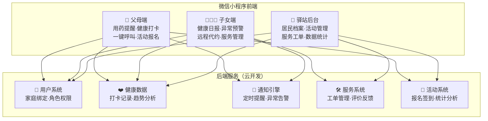

# 家邻康（silver-care）— 项目 AI 上下文

> 社区健康助手 · 让子女放心，让父母省心
> **当前阶段**：MVP 开发 | **时间戳**：2026-03-03

---

## 📋 高层愿景

基于微信小程序的社区居家养老健康管理平台，通过"子女远程关怀 + 老人日常打卡 + 社区驿站服务"三位一体模式，解决 3 亿居家老人的健康管理和子女远程关怀需求。

**核心价值**：
- **老人**：吃药易忘 → 定时提醒、一键打卡、一键呼叫
- **子女**：不在身边 → 每日健康报告、异常预警、远程代约服务
- **社区**：管理低效 → 居民档案、活动管理、服务工单系统

---

## 🏗️ 架构总览



---

## 📦 模块索引

| 模块 | 路径 | 描述 | 状态 |
|------|------|------|------|
| **父母端** | `packages/parent-app` | 老人使用的小程序 | 📋 规划中 |
| **子女端** | `packages/children-app` | 子女使用的小程序 | 📋 规划中 |
| **驿站后台** | `packages/station-admin` | 社区驿站管理后台 | 📋 规划中 |
| **云函数** | `packages/cloud-functions` | 后端业务逻辑 | 📋 规划中 |
| **共享库** | `packages/shared` | 类型定义、工具函数 | 📋 规划中 |

---

## 🎯 MVP 功能清单

### Phase 1 — 核心功能（第 1-4 周）

| 功能 | 父母端 | 子女端 | 优先级 |
|------|--------|--------|--------|
| 用药提醒与打卡 | 收到提醒 → 点"已服药" | 查看打卡记录 | **P0** |
| 血压/血糖记录 | 手动输入或语音输入 | 查看趋势图表 | **P0** |
| 健康日报 | — | 每晚自动推送 | **P0** |
| 异常预警 | — | 漏打卡/数据异常时推送 | **P0** |
| 家庭绑定 | 被邀请加入 | 扫码绑定父母 | **P0** |

### Phase 2 — 社区功能（第 5-6 周）

| 功能 | 说明 | 优先级 |
|------|------|--------|
| 社区活动列表 | 展示附近驿站活动 | **P1** |
| 活动报名 | 父母端一键报名 | **P1** |
| 一键呼叫子女 | 大按钮，直接拨打电话 | **P1** |

### Phase 3 — 服务功能（第 7-8 周）

| 功能 | 说明 | 优先级 |
|------|------|--------|
| 上门服务预约 | 子女代约/老人自约 | **P2** |
| 服务评价 | 完成后评分评价 | **P2** |
| 会员订阅 | 付费解锁高级功能 | **P2** |

---

## 🌍 全局规范

### 技术栈

- **前端框架**：微信小程序原生 / Taro（可选）
- **后端**：微信云开发（云函数 + 数据库 + 存储）
- **数据库**：MongoDB（云开发内置）
- **包管理**：pnpm（monorepo）
- **类型系统**：TypeScript
- **测试**：Jest + Vitest
- **代码质量**：ESLint + Prettier

### 代码组织

- **文件大小**：单文件 ≤ 800 行，函数 ≤ 50 行
- **命名规范**：
  - 组件/类：`PascalCase`
  - 函数/变量：`camelCase`
  - 常量：`UPPER_SNAKE_CASE`
  - 文件：`kebab-case`
- **不可变性**：ALWAYS 创建新对象，NEVER 直接修改
- **错误处理**：所有异步操作必须 try-catch，提供用户友好的错误信息
- **输入验证**：使用 Zod 或类似库验证所有用户输入

### 适老化设计原则

```
1. 字体：最小 18px，关键信息 24px+
2. 按钮：最小 48x48px 触摸区域，间距 12px+
3. 颜色：高对比度，避免纯灰色文字
4. 操作：核心流程不超过 3 步
5. 语音：支持语音输入血压/血糖数值
6. 反馈：每次操作都有明确的视觉 + 震动反馈
7. 导航：底部固定 Tab，不超过 4 个入口
```

### 测试覆盖率

- **最低要求**：80% 覆盖率
- **测试类型**：单元测试 + 集成测试 + E2E 测试
- **工作流**：RED → GREEN → IMPROVE（TDD）

### 安全规范

- ✅ 无硬编码密钥（使用环境变量）
- ✅ 所有用户输入验证
- ✅ 健康数据加密存储
- ✅ 最小权限原则（角色权限控制）
- ✅ 错误信息不泄露敏感数据

### 提交规范

```
<type>: <description>

<optional body>
```

**Types**：feat, fix, refactor, docs, test, chore, perf, ci

---

## 📊 商业模式

### 收入来源

```
┌──────────────────────────────────────────────────┐
│                  收入来源                          │
├──────────┬────────────┬────────────┬─────────────┤
│ C端订阅   │ 服务佣金    │ 政府采购    │ 增值合作     │
│ (核心)    │ (第二曲线)  │ (放大器)   │ (长期)      │
│          │            │            │             │
│ 子女为父母 │ 上门服务    │ 社区养老    │ 健康品牌     │
│ 购买会员   │ 每单抽佣    │ 信息化建设  │ 精准推荐     │
│          │ 10-15%     │ 项目制     │ 按效果付费   │
│ ¥29/月   │            │            │             │
│ ¥299/年  │            │            │             │
└──────────┴────────────┴────────────┴─────────────┘
```

### 定价策略

| 套餐 | 价格 | 包含内容 |
|------|------|---------|
| **基础版（免费）** | ¥0 | 用药提醒（2 种药）、基础打卡、1 条/天异常通知 |
| **关怀版（主推）** | ¥29/月 或 ¥299/年 | 无限用药提醒、详细健康报告、多人关注、优先客服 |
| **尊享版** | ¥59/月 或 ¥599/年 | 关怀版全部 + 每月 2 次上门量血压 + 专属健康顾问 |

---

## 🚀 关键里程碑

```
M1（0-3月）种子验证
  ├── 完成 MVP 开发
  ├── 1 个社区试运营
  ├── 100 个家庭使用
  └── 验证核心指标：日活打卡率 > 50%

M2（4-6月）模式验证
  ├── 推出付费版本
  ├── 付费转化率 > 8%
  ├── 上线上门服务预约
  └── 复制到第 2-3 个社区

M3（7-12月）规模化准备
  ├── 覆盖 5 个社区
  ├── 500+ 注册家庭
  ├── 标准化运营 SOP
  └── 寻求天使轮融资

M4（13-24月）区域扩张
  ├── 覆盖 20-30 个社区
  ├── 5000+ 注册家庭
  ├── 月收入 > 10 万
  └── 对接政府养老服务采购

M5（25-36月）城市级覆盖
  ├── 80-100 个社区
  ├── 20000+ 注册家庭
  ├── 实现盈利
  └── 复制到第二个城市
```

---

## 📚 模块详情

- 👉 [父母端详情](./packages/parent-app/CLAUDE.md)
- 👉 [子女端详情](./packages/children-app/CLAUDE.md)
- 👉 [驿站后台详情](./packages/station-admin/CLAUDE.md)
- 👉 [云函数详情](./packages/cloud-functions/CLAUDE.md)
- 👉 [共享库详情](./packages/shared/CLAUDE.md)

---

## 🔗 相关文档

- [竞品分析](./docs/01-竞品分析.md)
- [商业计划书](./docs/02-商业计划书.md)

---

**最后更新**：2026-03-03 | **维护者**：AI Context System
